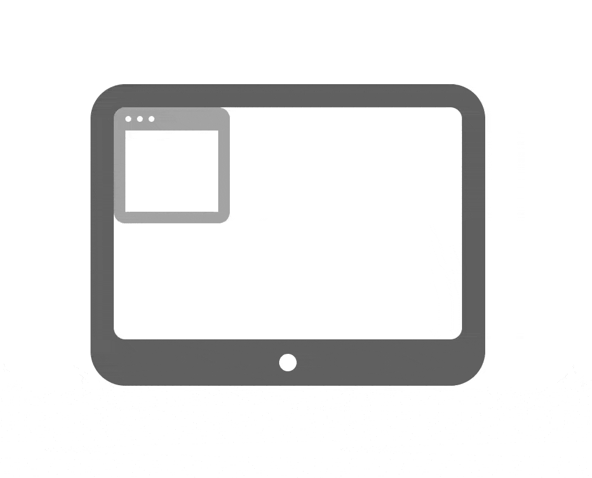

# Windowpane

> *If you want to touch the sky* /<BR>
> *Just put a window in your eye*

Windowpane is a grid-based window manager written purely in OS X's [JavaScript for Automation](https://developer.apple.com/library/mac/releasenotes/InterapplicationCommunication/RN-JavaScriptForAutomation/Articles/OSX10-10.html#//apple_ref/doc/uid/TP40014508-CH109-SW1) feature introduced in OS X Yosemite 10.10.



Unfortunately, windows don't animate smoothly to their new locations like that (although that would be awesome); instead, they jump there instantly.

## Inspiration

Windowpane is inspired by [Mjolnir](https://github.com/sdegutis/mjolnir). In fact, it's mainly just a port of the [mjolnir.sd.grid](https://luarocks.org/modules/sdegutis/mjolnir.sd.grid) Lua scripts to JavaScript. The scripts act as framework for positioning windows in the screen divided into horizontal rows and vertical columns.

## Prerequisites

To use Windowpane, you must have a keyboard shortcut listener that can trigger an AppleScript, and [access for assistive devices](https://support.apple.com/en-us/HT202866) must be enabled for it.

I use [FastScripts](https://red-sweater.com/fastscripts/) for this, but [Keyboard Maestro](https://www.keyboardmaestro.com/main/) or [Alfred](https://www.alfredapp.com/) should work too.

Theoretically, OS X's built-in Services system would be able to act as a keyboard shortcut listener as well, but in practice it doesn't work because Services run as the frontmost application. Therefore, they can't manipulate window the size and position of windows unless access for assistive devices is enabled for *every application*.

## Installation

Installing Windowpane consists of three tedious steps, followed by even more tedious configuration:

1. Copy the source of the `windowpane.js` file into a new [Script Editor](https://developer.apple.com/library/mac/documentation/LanguagesUtilities/Conceptual/MacAutomationScriptingGuide/GettoKnowScriptEditor.html)
2. In Script Editor, set the language type to JavaScript.
3. Save it as `windowpane.scpt` to `~/Library/Script Libraries`.
4. Repeat the above with `windowpane-config.js`, saving it as `windowpane-config.scpt`
5. Setup your keyboard shortcut listener to run an example script to manage a windows state.

Here's an example script to move the frontmost window to be half the screen size on the left:

``` AppleScript
WindowpaneConfig = Library('windowpane-config');
WindowpaneConfig.makeFocusedWindowHalfScreenLeft();
```

`makeFocusedWindowHalfScreenLeft` is a function defined in `windowpane-config`. Reading the source code for `windowpane-config.js` to find our which functions are already supported. The existing configuration can be extended to support other window configurations.

### Script Libraries

Windowpane uses a little known AppleScript feature called [Script Libraries](https://developer.apple.com/library/mac/documentation/AppleScript/Conceptual/AppleScriptLangGuide/conceptual/ASLR_script_objects.html#//apple_ref/doc/uid/TP40000983-CH207-SW6), whereby any script contained in the `~/Library/Script Libraries` folder can be imported and run by another script, as illustrated by the above `makeFocusedWindowHalfScreenLeft` example.

## Configuration

Windowpane has two components:

1. `windowpane.js`: A library of functions for managing windows  (e.g., `getFrameForFocusedWindow` or `nearestGridCoordinatesForFrame`).
2. `windowpane-config.js`: A configuration library of functions for moving windows to specific configurations (e.g., `makeFocusedWindowHalfScreenLeft` or `moveFocusedWindowLeft`)

The `windowpane-config.js` file is meant to be edited and extended to support other window configurations.

## Tests

Automated tests for Windowpane can be run by executing the shell script at `scripts/run_tests.sh`

The tests will close, open, and move Finder windows. In other words, don't run them unless you don't mind losing your current Finder window state.

When running the tests from the terminal, access for assistive devices will have to be enabled for the terminal application itself.
